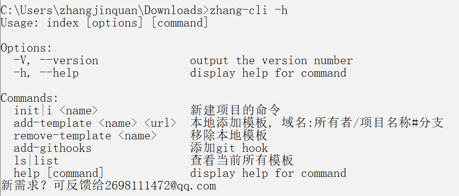

- npm 安装使用

```
npm 地址：https://www.npmjs.com/package/zhang-web-cli

全局安装命令：npm install -g zhang-web-cli
```

- 克隆仓库使用

```
克隆仓库：https://github.com/zhang-bcxb/zhang-web-cli.git

在当前根目录下面运行命令：
安装：npm link
卸载：npm unlink

解释：【npm link】可以帮助我们模拟包安装后的状态，它会在系统中做一个快捷方式映射，让本地的包就好像 install 过一样可以直接使用
```

- 查看帮助



- 新建项目


- 使用 npx 查看

